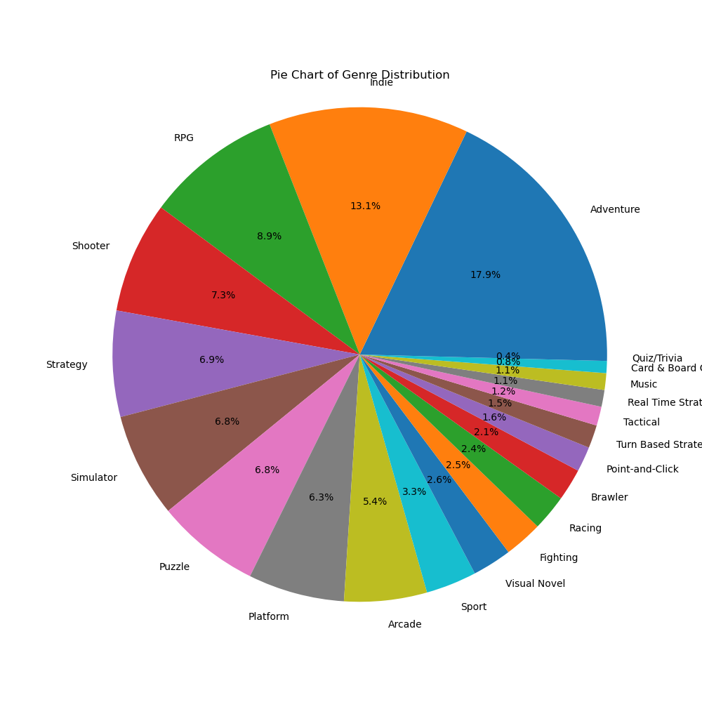
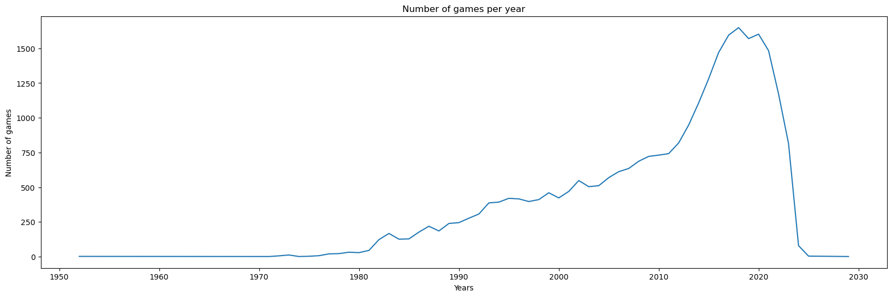
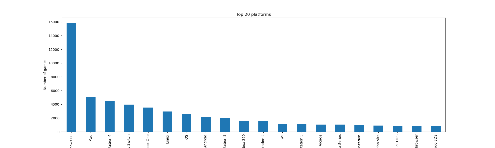
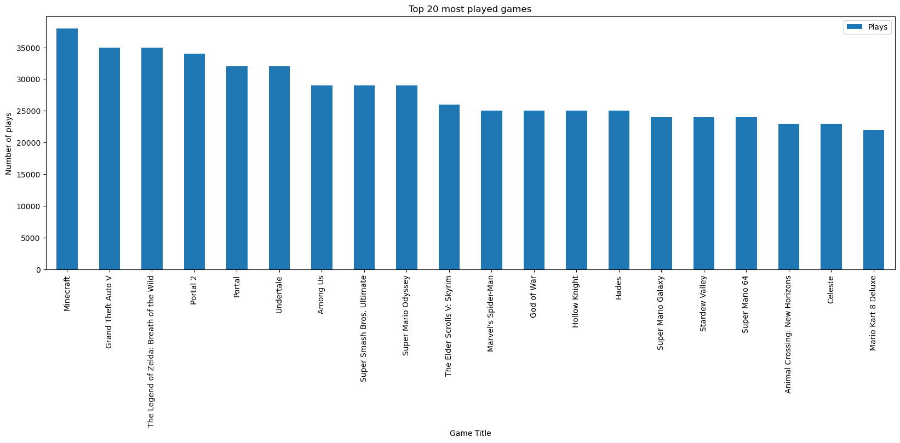

## Milestone 1

### Dataset

> Find a dataset (or multiple) that you will explore. Assess the quality of the data it contains and how much preprocessing / data-cleaning it will require before tackling visualization. We recommend using a standard dataset as this course is not about scraping nor data processing.
>
> Hint: some good pointers for finding quality publicly available datasets ([Google dataset search](https://datasetsearch.research.google.com/), [Kaggle](https://www.kaggle.com/datasets), [OpenSwissData](https://opendata.swiss/en/), [SNAP](https://snap.stanford.edu/data/) and [FiveThirtyEight](https://data.fivethirtyeight.com/)), you could use also the DataSets proposed by the ENAC (see the Announcements section on Zulip).

We used a dataset that we found on [kaggle](https://www.kaggle.com/). This is the [video games dataset](https://www.kaggle.com/datasets/matheusfonsecachaves/popular-video-games) which contains a csv file named [backloggd_games.csv](/data/backloggd_games.csv). This file contains information about 40985 video games from 1980 to 2023. The fileds of this dataset are :
- Title: title of the game
- Release_date: the release date of the game
- Developers: the company/developers of the game (missing for 30% of the games)
- Summary: a brief summary of the game (missing for 8% of the games)
- Platforms: the platforms on which the game is available
- Genres: the genres of the game
- Rating: whic the rating of the whic is float value between 0 and 5. Some games haven't got a rating since there are not released.
- Plays: which the number of players who have already played to the game (integer value). The games that hasn't been released, doesn't have this field.
- Playing: The number of players currently playing to this game(integer value). The games that hasn't been released, doesn't have this field.
- Backlogs: the number of people that own the game and haven't played to it (integer value). The games that hasn't been released, doesn't have this field.
- Wishlist: the umber of players who the game in their wishlist (integer value). The games that hasn't been released, doesn't have this field.
- Reviews: The number of reviews relative to this game (integer value).
- we doesn't keep the Lists attribute of this data set since it's irrelevant  for our visualization. 

# Data Cleaning:
You can find the data cleaning proceed on the dataset on this [notebook](/milestone_1/data_processing_games.ipynb). In the data cleaning processing,we first delete the dupliacte rows. We convert each columns to his correct corresponding type (for example in date format, float type or integer type). We drop all the rows that haven't got a realease date, developers, platforms and/or genres. The majority of incomplete rows was composed of gmes that haven't beeb relased yet and we choose to work only on games that are now available.

### Problematic

> Frame the general topic of your visualization and the main axis that you want to develop.

#  How is the video game spread across different genres and platforms throughout the years around the globe ?

In 1962, the first video game, Spacewar!, was created. Since this date, each year more and more video games are developed. The studios that developed these games are spread around the world. The video games are defined by a multiple of genres and are developed to be used on different platforms. 

> - What am I trying to show with my visualization?

In our visualizations, we would like to show how each year more and more video games are released. We also would like to show the diversity of the genre, the repartition of the games on the platforms and that these games are develop by many different developers.

> - Think of an overview for the project, your motivation, and the target audience.

By our visulizations, we would like to show that the video games are defined by their deversities at different scales.

### Exploratory Data Analysis

> Pre-processing of the data set you chose
> - Show some basic statistics and get insights about the data

A first processing of the dataset has been realized in this [notebook](/milestone_1/data_processing_games.ipynb). In a fist part, we first clean the dataset as explained in the previous part relative to the dataset.

We use the `pandas` and `numpy` libraries to load and procees the data. We also used `matplotlib` to relaized the graphs displayed bellow. You can find bellow some graphs that present some aspects of our dataset and it can give an idea of how we can use this dataset to relized some vizualization relative to our subject.

# Genre Pie Chart

*This provides an overview of the distribution of different genres of games.
It can help identify popular genres, which might influence the preferences of developers, platforms, and players.*

# Games Per Year

*Shows the number of games released each year.
Trends in game releases may correlate with shifts in genre popularity or technological advancements.*

# Top 20 Platforms

*Identifies the platforms (such as consoles, PC, mobile) where games are being played.
Platforms can dictate the type of games available due to hardware capabilities and audience demographics.*

# Top 20 Developers

*Lists the most successful game developers based on various metrics like sales, critical acclaim, or market share.
These developers often have a significant influence on the types of games produced and may specialize in certain genres or platforms.*

# Top 20 Game Plays

*Reflects the popularity of specific games based on the number of plays or downloads.
Games with high play counts may indicate strong developer support, effective marketing, or exceptional gameplay.*

### Related work

> - What others have already done with the data?

Other have used this data for ml training to predict the [ratings](https://www.kaggle.com/code/dima806/rating-prediction-ml-shap) or the [success](https://www.kaggle.com/code/xreina8/predicting-video-game-success-a-machine-l-appr) of future videogames.

> - Why is your approach original?

We want to show the success of video games over the years. The video games are developed for specific platforms. It is interseting to show which platforms was the more popular on a given period. The video games are also caracterize by their genres. There are multiple genre of video games and we want to show the evolution of the genre over the years and how the genre are partitioned. we can also linked genre to developers to see wether they stick to some genre or have a wide variety of genre.

> - What source of inspiration do you take? Visualizations that you found on other websites or magazines (might be unrelated to your data).

> - In case you are using a dataset that you have already explored in another context (ML or ADA course, semester project...), you are required to share the report of that work to outline the differences with the submission for this class.