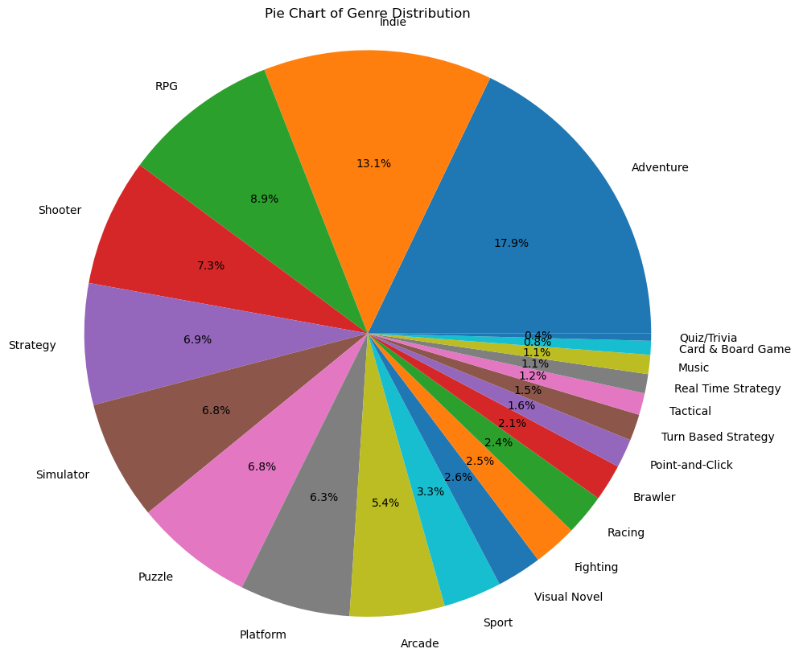
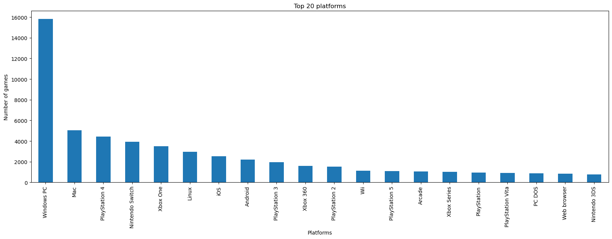
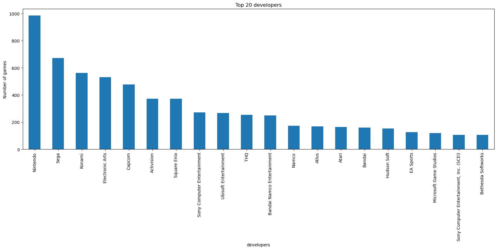

# Milestone 1

## Dataset

> Find a dataset (or multiple) that you will explore. Assess the quality of the data it contains and how much preprocessing / data-cleaning it will require before tackling visualization. We recommend using a standard dataset as this course is not about scraping nor data processing.
>
> Hint: some good pointers for finding quality publicly available datasets ([Google dataset search](https://datasetsearch.research.google.com/), [Kaggle](https://www.kaggle.com/datasets), [OpenSwissData](https://opendata.swiss/en/), [SNAP](https://snap.stanford.edu/data/) and [FiveThirtyEight](https://data.fivethirtyeight.com/)), you could use also the DataSets proposed by the ENAC (see the Announcements section on Zulip).

We used a dataset that we found on [kaggle](https://www.kaggle.com/). This is the [video games dataset](https://www.kaggle.com/datasets/matheusfonsecachaves/popular-video-games) which contains a csv file named [backloggd_games.csv](/data/backloggd_games.csv). This file contains information about 40985 video games from 1980 to 2023. The fileds of this dataset are :
- Title: title of the game
- Release_date: release date of the game
- Developers: company/developers of the game (missing for 30% of the games)
- Summary: brief summary of the game (missing for 8% of the games)
- Platforms: platforms on which the game is available
- Genres: genres of the game
- Rating: rating of the game between 0 and 5 (float value). Some games do not have ratings.
- Plays: number of players who have already played the game (integer value). The games that hasn't been released, do not have this field.
- Playing: number of players currently playing this game (integer value). The games that hasn't been released, do not have this field.
- Backlogs: number of people that own the game and haven't played it (integer value). The games that hasn't been released, do not have this field.
- Wishlist: number of players with the game in their wishlist (integer value). The games that hasn't been released, do not have this field.
- Reviews: number of reviews relative to this game (integer value).
- we doesn't keep the Lists attribute of this data set since it's irrelevant for our visualization. 

### Data Cleaning:
You can find the data cleaning process of the dataset on this [notebook](/milestone_1/data_processing_games.ipynb). In the data cleaning processing, we first deleted the dupliacted rows. We converted each columns to their correct corresponding type (for example date format, float type or integer type). We droped all the rows that do not have a realease date, developers, platforms and/or genres. The majority of incomplete rows was composed of games that have not been relased yet and we chose to work only on games that are now available.

## Problematic

> Frame the general topic of your visualization and the main axis that you want to develop.

###  How is the video game spread across different genres and platforms throughout the years around the globe ?

In 1962, the first video game, Spacewar!, was created. Since this date, each year more and more video games are developed. The studios that developed these games are spread around the world. The video games are defined by a multiple of genres and are developed to be used on different platforms. 

> - What am I trying to show with my visualization?

In our visualizations, we would like to show how each year more and more video games are released. We also would like to show the diversity of the genre, the repartition of the games on the platforms and the variety of developers.

> - Think of an overview for the project, your motivation, and the target audience.

We would like to study the video games in a global context. Our visualization will be seperated in three distinct parts:
- genres of the videogames along the years
- platforms of the videogames along the years
- developers of the videogames and their games developed along the years
Finally, a last part will be dedicated to a correlation between these three parts.

The target audiance would be anyone interseted in or want to learn about videogames, how it is caracterized and the evolution of this market.

By using our visualiztion, users will be able to see this evolution and be able to correlate the caracteristics of the videogames that will be developed in the following years.

## Exploratory Data Analysis

> Pre-processing of the data set you chose
> - Show some basic statistics and get insights about the data

A first processing of the dataset has been realized in this [notebook](/milestone_1/data_processing_games.ipynb). In a fist part, we cleaned the dataset as explained in the previous part relative to the dataset.

We use the `pandas` and `numpy` libraries to load and process the data. We also used `matplotlib` to realize the graphs displayed below. You can find below some graphs that present some aspects of our dataset and it can give an idea of how we can use this dataset for some vizualization relative to our subject.

### Genre Pie Chart

*This provides an overview of the distribution of different genres of games.
It can help identify popular genres, which might influence the preferences of developers, platforms, and players.*

### Games Per Year

*Shows the number of games released each year.
Trends in game releases may correlate with shifts in genre popularity or technological advancements.*

### Top 20 Platforms

*Identifies the platforms (such as consoles, PC, mobile) where games are being played.
The number of games developed on each platforms highlights the popularity of the platforms.*

### Top 20 Developers

*Lists the most successful game developers based on the number of games developed.
These developers may have an influence on the types of games produced and may also specialize in certain genres or platforms.*

### Top 20 Game Plays

*Reflects the popularity of specific games based on the number of plays.
Games with high play counts could indicate a certain popularity.*

# Remarks: 
this is an example of the visualizations we could do, what we want to show is the correlation between the genre, developers, platforms and/or number of players as the years pass.

## Related work

> - What others have already done with the data?

Other have used this data for ml training to predict the [ratings](https://www.kaggle.com/code/dima806/rating-prediction-ml-shap) or the [success](https://www.kaggle.com/code/xreina8/predicting-video-game-success-a-machine-l-appr) of future videogames.

> - Why is your approach original?

We want to show the success of video games over the years. The video games are developed for specific platforms. It is interesting to show which platforms was the more popular on a given period. The video games are also caracterize by their genres. There are multiple genre of video games and we want to show the evolution of the genre over the years and how the genre are partitioned. We can also linked genre to developers to see wether they stick to some genre or have a wide variety of genre.

> - What source of inspiration do you take? Visualizations that you found on other websites or magazines (might be unrelated to your data).

We took inspirations from previous years projects and we wanted to have a dataset from videogames. we would like to work on vizualizations based on video games since this domain quickly evlolved during this last 20 years. We would like to understand the cacteristics of this evalution.
